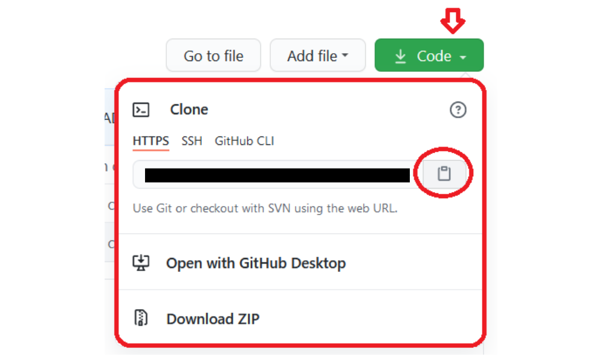

Antes de llevar a cabo el proceso de instalación, puedes echarle un vistazo a como se vería tu web estática con Jekyll y WhySoSimple mediante este link: [https://whysosimple-jekylltemplate.vercel.app/](https://whysosimple-jekylltemplate.vercel.app/)

## 1. Instalar jekyll

Visita la página [https://jekyllrb.com/docs/installation/](https://jekyllrb.com/docs/installation/) para llevar a cabo una instalación adecuada dependiendo tu sistema operativo.

### Inicio rapido de instalación en Arch Linux

#### Instalar (Arch Linux):

- Instalar **`sudo pacman -S ruby base-devel ruby-erb`**

- Instalar EN RAÍZ **`gem install jekyll bundler`**

#### Instalar (Debian):

- Instalar **`sudo apt-get install ruby-full build-essential`**

- Instalar **`sudo apt install rubygems -y`**

- Instalar EN RAÍZ **`gem install jekyll bundler`**

- Instalar Bundle **`sudo apt-get -y install bundler`**

- Instalar Npm **`sudo apt install npm -y`**

- Instalar Nodejs **`sudo apt install nodejs -y`**

---

Agregar la variable al PATH en al archivo `.profile` o `.bash_profile`

```sh
export GEM_HOME="$HOME/.local/share/gem/ruby/versionDelRuby"
export GEM_PATH="$GEM_HOME"
export PATH="$GEM_HOME/bin:$PATH"
```

Aplicar la `$GEM_HOME` en la terminal mediante el comando **`source ~/.profile`** o **`source ~/.bash_profile`** (dependiendo el archivo en donde agregaste la variable al PATH)

## 2. Clona este repo en tu sistema :)



## 3. Instalar las bundler gems

Dentro de la carpeta de tu proyecto (o dentro de la carpeta de este repo clonada en tu sistema) ejecuta el comando `bundle install` en la terminal.

## 4. Iniciar servidor local web

Para iniciar el servidor local web usa el comando **`bundle exec jekyll serve`** en la terminal y dentro de la carpeta de tu proyecto (o dentro de la carpeta de este repo clonada en tu sistema)


---

Nota: La documentación adicional y completa se encuentra en el mismo repo, solo necesitas desplegar el servidor web local cuando hayas completado los pasos anteriores. En el paso número 4 se te indica como iniciar un servidor local web con jekyll.

---

**(Adicional)** El template cuenta con el buscador Pagefind, lo cual solo se debe tener en cuenta el siguiente código para ser adicionado en el lugar en donde se desee ubicar:

```html
<link href="/pagefind/pagefind-ui.css" rel="stylesheet">
```

1) Este primero en la etiqueta `<head></head>` del sitio en donde será ubicado, ya que permitirá el uso de estilos css predeterminados de Pagefind.

```html
<script src="/pagefind/pagefind-ui.js"></script>
<div id="search"></div>
<script>
    window.addEventListener('DOMContentLoaded', (event) => {
        new PagefindUI({ element: "#search", showSubResults: true });
    });
</script>
```

2) Este segundo en las etiquetas determinadas en donde se desee ubicar en la página o en el sitio.

```sh
npx pagefind --site "_site"
```

3) Indexar el sitio para Pagefind (Notese que "_site" corresponde al caso especifico y por defecto de que la carpeta en donde los archivos estaticos sean generados sea dicha carpeta.

4) Como último paso: **Detener el servidor local con Ctrl+c** y volverlo a desplegar mediante `bundle exec jekyll serve`
